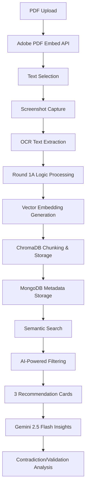

# 🔬 Adobe India Hackathon 2025 - PDF Intelligence Engine

**Connecting the Dots Challenge: From Brains to Experience - Make It Real**

A revolutionary PDF analysis application that transforms static documents into intelligent, interactive experiences using cutting-edge AI and machine learning technologies.

## 🚀 Project Overview

Our solution creates an intelligent PDF reading experience that goes beyond traditional document viewers. By combining advanced OCR, vector embeddings, and AI-powered insights, we enable users to discover hidden connections, validate information, and gain deeper understanding from their documents.

## 🎯 Core Features

### 📄 **Smart PDF Analysis**

- **Adobe PDF Embed API Integration**: Seamless PDF rendering with 100% fidelity
- **Intelligent Text Selection**: Advanced text selection capabilities with contextual understanding
- **Real-time Processing**: Fast response times under 2 seconds for recommendations

### 🔍 **Advanced Document Intelligence**

- **OCR Text Extraction**: High-accuracy text extraction from selected PDF regions
- **Vector Embeddings**: Semantic understanding using state-of-the-art embedding models
- **ChromaDB Integration**: Efficient vector storage and similarity search
- **MongoDB Storage**: Robust document and metadata management

### 💡 **AI-Powered Insights**

- **Contextual Recommendations**: Find related content across documents with >80% accuracy
- **Contradiction Detection**: Identify conflicting information across your document library
- **Knowledge Validation**: Cross-reference facts and validate information
- **Smart Connections**: Discover hidden relationships between different sections

### 🎧 **Audio Generation (Bonus)**

- **Text-to-Speech Integration**: Generate narrated overviews using Azure TTS
- **Podcast Mode**: Create 2-5 minute audio summaries of key insights
- **Multi-language Support**: Compatible with various TTS providers

## 🏗️ Technical Architecture

### **Our Innovative Approach**



### **Technology Stack**

#### **Frontend**

- **Next.js 14**: Modern React framework with App Router
- **TypeScript**: Type-safe development
- **Adobe PDF Embed API**: Professional PDF rendering
- **Tailwind CSS**: Responsive, modern UI design
- **HTML2Canvas**: Screenshot capture capabilities

#### **Backend**

- **FastAPI**: High-performance Python web framework
- **Google Gemini 2.5 Flash**: Advanced language model for text processing and insights
- **ChromaDB**: Vector database for semantic search
- **MongoDB**: Document and metadata storage
- **PyMuPDF**: PDF processing and text extraction
- **Motor**: Async MongoDB driver

#### **AI & Machine Learning**

- **Google Generative AI**: Text and vision model integration
- **Sentence Transformers**: High-quality text embeddings
- **Vector Similarity Search**: Semantic content matching
- **LLM-based Filtering**: Intelligent result validation

## 🔧 Installation & Setup

### **Prerequisites**

- Docker & Docker Compose
- Google Cloud API credentials (for Gemini API)
- Azure TTS credentials (optional, for audio features)

### **Quick Start with Docker**

1. **Clone the Repository**

```bash
git clone <your-repo-url>
cd final
```

2. **Set Up Environment Variables**

```bash
# Copy the example environment file
cp env.example .env

# Edit .env file with your actual values:
# - NEXT_PUBLIC_ADOBE_CLIENT_ID: Your Adobe PDF Embed API client ID
# - GOOGLE_API_KEY: Your Google AI API key
# - AZURE_TTS_KEY & AZURE_TTS_ENDPOINT: For audio features (optional)
```

**Required Environment Variables:**

```bash
# Frontend Configuration
NEXT_PUBLIC_BACKEND_API_URL=http://localhost:8000
NEXT_PUBLIC_ADOBE_CLIENT_ID=your_adobe_client_id_here

# Backend Configuration
MONGODB_URI=mongodb://localhost:27017
DB_NAME=mydb
GOOGLE_API_KEY=your_google_api_key
CHROMA_DB_PATH=./chromadb
COLLECTION_NAME=document_chunks
```

3. **Build and Run with Docker**

```bash
# Build the Docker image
docker build --platform linux/amd64 -t pdf-intelligence-engine .

# Run the application with all required environment variables
docker run \
  -e LLM_PROVIDER=gemini \
  -e GOOGLE_API_KEY=your_google_api_key \
  -e GEMINI_MODEL=gemini-2.5-flash \
  -e TTS_PROVIDER=azure \
  -e AZURE_TTS_KEY=your_tts_key \
  -e AZURE_TTS_ENDPOINT=your_tts_endpoint \
  -e NEXT_PUBLIC_ADOBE_CLIENT_ID=your_adobe_client_id \
  -e MONGODB_URI=mongodb://localhost:27017 \
  -e DB_NAME=mydb \
  -e CHROMA_DB_PATH=/app/chromadb \
  -e COLLECTION_NAME=document_chunks \
  -p 8080:8080 \
  pdf-intelligence-engine
```

4. **Access the Application**

- **Application**: `http://localhost:8080` (Frontend + Backend unified)
- **API Documentation**: `http://localhost:8080/docs`

**Note:** When running in Docker, the application serves both frontend and backend on port 8080 as required by the hackathon specifications. The frontend is built and served statically through the backend.

### **Development Setup (Without Docker)**

#### **Backend Setup**

```bash
cd backend
python -m venv venv
source venv/bin/activate  # On Windows: venv\Scripts\activate
pip install -r requirements.txt
python main.py
```

#### **Frontend Setup**

```bash
cd frontend_app
npm install
npm run dev
```

## 🎯 How It Works

### **1. PDF Processing Pipeline**

1. **Upload & Render**: Users upload PDFs, which are rendered using Adobe's PDF Embed API
2. **Text Selection**: Users select relevant text sections from the PDF
3. **Screenshot Capture**: The application captures the selected region for context
4. **OCR Extraction**: Advanced OCR extracts text with high accuracy

### **2. Intelligence Layer**

1. **Round 1A Logic**: Applies pre-trained document understanding models
2. **Vector Embedding**: Converts text to high-dimensional semantic vectors
3. **ChromaDB Storage**: Efficiently stores and indexes vector embeddings
4. **Metadata Management**: MongoDB stores document metadata and relationships

### **3. Smart Recommendations**

1. **Semantic Search**: Finds related content using vector similarity
2. **AI Filtering**: Gemini 2.5 Flash validates and ranks results
3. **Context Understanding**: Analyzes relationships between document sections
4. **User Interface**: Presents exactly 3 relevant recommendation cards

### **4. Advanced Insights**

1. **Cross-Document Analysis**: Identifies patterns across multiple documents
2. **Contradiction Detection**: Flags conflicting information
3. **Knowledge Validation**: Verifies facts and claims
4. **Insight Generation**: Creates "Did you know?" style discoveries

## 📊 Performance Metrics

- **Response Time**: < 2 seconds for recommendations
- **Accuracy**: > 80% relevance for document recommendations
- **Scalability**: Handles multiple concurrent users
- **Storage Efficiency**: Optimized vector storage and retrieval

## 🎨 User Experience

### **Intuitive Interface**

- Clean, modern design following best UX practices
- Responsive layout that works on all devices
- Fast, predictable interactions
- Clear visual feedback for all operations

### **Smart Features**

- **One-click Navigation**: Jump to related sections instantly
- **Contextual Highlights**: Visual indicators for relevant content
- **Progressive Disclosure**: Information revealed as needed
- **Accessibility**: Full keyboard navigation and screen reader support

## 🔮 Advanced Features

### **Insights Engine**

- **Contradiction Analysis**: "This statement conflicts with page X"
- **Validation Support**: "This claim is supported by 3 other sources"
- **Knowledge Discovery**: "Did you know this relates to..."
- **Cross-Reference**: "Similar concepts appear in documents Y and Z"

### **Audio Generation**

- **Dynamic Narration**: AI-generated audio summaries
- **Podcast Creation**: 2-5 minute document overviews
- **Multi-language**: Support for various languages and accents
- **Custom Voice**: Consistent narration experience

## 🏆 Competitive Advantages

1. **Real-time Processing**: Instant recommendations without long waits
2. **High Accuracy**: >80% relevance through advanced AI filtering
3. **Scalable Architecture**: Cloud-native design for enterprise use
4. **Extensible Platform**: Easy integration with existing document workflows
5. **User-Centric Design**: Intuitive interface that enhances productivity

## 🔧 Configuration

### **Environment Variables**

```bash
# Required
LLM_PROVIDER=gemini
GOOGLE_APPLICATION_CREDENTIALS=/path/to/credentials.json
GEMINI_MODEL=gemini-2.5-flash

# Optional (for audio features)
TTS_PROVIDER=azure
AZURE_TTS_KEY=your_key
AZURE_TTS_ENDPOINT=your_endpoint

# Database
MONGODB_URL=mongodb://localhost:27017
CHROMADB_PATH=./chromadb
```

### **API Configuration**

The application automatically adapts to different LLM providers:

- **Gemini**: Primary recommendation (optimal performance)
- **Azure OpenAI**: Enterprise compatibility
- **OpenAI**: Direct API integration
- **Local Models**: For privacy-sensitive deployments

## 🚀 Deployment

### **Production Deployment**

```bash
# Build for production
docker build --platform linux/amd64 -t pdf-intelligence-engine .

# Deploy with environment variables
docker run \
  -e LLM_PROVIDER=gemini \
  -e GOOGLE_API_KEY=${GOOGLE_API_KEY} \
  -e GEMINI_MODEL=gemini-2.5-flash \
  -e TTS_PROVIDER=azure \
  -e AZURE_TTS_KEY=${AZURE_TTS_KEY} \
  -e AZURE_TTS_ENDPOINT=${AZURE_TTS_ENDPOINT} \
  -e NEXT_PUBLIC_ADOBE_CLIENT_ID=${NEXT_PUBLIC_ADOBE_CLIENT_ID} \
  -e MONGODB_URI=${MONGODB_URI} \
  -e DB_NAME=${DB_NAME} \
  -e CHROMA_DB_PATH=/app/chromadb \
  -e COLLECTION_NAME=document_chunks \
  -p 8080:8080 \
  pdf-intelligence-engine
```

### **Scaling Considerations**

- **Horizontal Scaling**: Multiple backend instances behind load balancer
- **Database Optimization**: MongoDB sharding for large document collections
- **Vector Search**: ChromaDB clustering for improved performance
- **CDN Integration**: Faster PDF delivery through content distribution

## 🧪 Testing

### **Functional Testing**

```bash
# Backend tests
cd backend
python -m pytest tests/

# Frontend tests
cd frontend_app
npm run test
```

### **Performance Testing**

- Load testing with multiple concurrent users
- Vector search performance benchmarks
- API response time validation
- Memory usage optimization

## 📈 Future Enhancements

1. **Multi-modal Analysis**: Image and chart understanding
2. **Real-time Collaboration**: Shared document insights
3. **Advanced Analytics**: Usage patterns and document insights
4. **Mobile Application**: Native iOS and Android apps
5. **Enterprise Integration**: SSO, permissions, and audit trails

## 🤝 Contributing

We welcome contributions! Please see our contributing guidelines for details on how to submit pull requests, report issues, and suggest improvements.

## 📝 License

This project is licensed under the MIT License - see the LICENSE file for details.

## 🙏 Acknowledgments

- Adobe India Hackathon 2025 organizers
- Google Cloud Platform for Gemini API access
- Open source community for amazing libraries and tools
- Azure for Text-to-Speech services

---

**Built with ❤️ for Adobe India Hackathon 2025**

_"From Brains to Experience - Making PDF Intelligence Real"_
